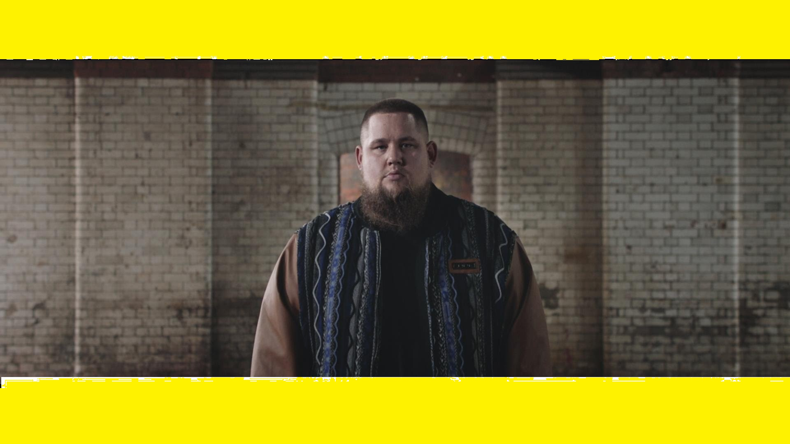

<html>
<head>
  <title>Hi</title>
</head>
<body bgcolor="yellow" text="purple
 

  <h1>All about me</h1>

 <h2>

</h2>

  
My name is Rufus, I am 12 years old and live in England.  I have blonde hair and blue eyes.

  <h2>my favorate things</h2>

<ol>
<ul> My Favourite  Colour: purple</ul>
<ul>I also like red</ul>
</ol>

<h2>My School</h2>

I am in year 7 at School.  At the moment in ICT, I am working on HTML.
<h2><b>Clubs</b></h2>

I do lots of clubs including ICT, RC, lego robotics and out of school piano, steel pans and BRLSI<a href="https://www.brlsi.org/">Click here to go to the BRLSI Website</a>
 

</body>
</html>    
